# perp-curie-contract - Perpetual Protocol Curie (V2) 核心合约

[](https://www.npmjs.com/package/@perp/curie-contract)

## 项目愿景

Perpetual Protocol Curie (V2) 是一个基于以太坊 Layer 2 (Optimism) 的去中心化永续合约交易协议。项目旨在提供高效、安全、透明的永续合约交易服务，构建完整的去中心化金融生态系统。

## 架构总览

本项目采用模块化架构，基于以太坊智能合约构建，集成 Uniswap V3 作为流动性基础，主要包含以下核心组件：

```
┌─────────────────────────────────────────────────────────┐
│                    永续合约交易协议                        │
├─────────────────────────────────────────────────────────┤
│  用户层 (User Layer)                                     │
├─────────────────────────────────────────────────────────┤
│  业务逻辑层 (Business Logic Layer)                       │
│  ┌──────────┬──────────┬──────────┬──────────────────┐  │
│  │清算所    │金库      │交易所    │订单簿            │  │
│  │Clearing │Vault     │Exchange  │OrderBook         │  │
│  │House    │          │          │                  │  │
│  └──────────┴──────────┴──────────┴──────────────────┘  │
│  ┌──────────┬──────────┬──────────┬──────────────────┐  │
│  │市场注册表│账户余额  │保险基金  │抵押品管理        │  │
│  │Market   │Account   │Insurance │Collateral        │  │
│  │Registry │Balance   │Fund      │Manager           │  │
│  └──────────┴──────────┴──────────┴──────────────────┘  │
├─────────────────────────────────────────────────────────┤
│  基础设施层 (Infrastructure Layer)                       │
│  ┌──────────┬──────────┬──────────┬──────────────────┐  │
│  │价格预言机│清算所配置│委托审批  │基础代币          │  │
│  │Price    │Clearing  │Delegate  │BaseToken         │  │
│  │Feed     │House     │Approval  │                  │  │
│  │         │Config    │          │                  │  │
│  └──────────┴──────────┴──────────┴──────────────────┘  │
├─────────────────────────────────────────────────────────┤
│  流动性层 (Liquidity Layer)                              │
│  ┌──────────────────────────────────────────────────┐  │
│  │              Uniswap V3                         │  │
│  │        (核心流动性基础设施)                      │  │
│  └──────────────────────────────────────────────────┘  │
└─────────────────────────────────────────────────────────┘
```

## 模块结构图

```mermaid
graph TD
    A["(根) perp-curie-contract"] --> B["contracts 核心合约"];
    B --> C["ClearingHouse 清算所"];
    B --> D["Vault 金库"];
    B --> E["Exchange 交易所"];
    B --> F["OrderBook 订单簿"];
    B --> G["MarketRegistry 市场注册表"];
    B --> H["AccountBalance 账户余额"];
    B --> I["InsuranceFund 保险基金"];
    B --> J["CollateralManager 抵押品管理"];
    B --> K["lib 数学库"];
    B --> L["interface 接口定义"];
    B --> M["base 基础合约"];

    C --> C1["openPosition 開倉"];
    C --> C2["closePosition 平倉"];
    C --> C3["addLiquidity 添加流動性"];
    C --> C4["removeLiquidity 移除流動性"];
    C --> C5["liquidate 清算"];

    D --> D1["deposit 存款"];
    D --> D2["withdraw 取款"];
    D --> D3["getFreeCollateral 可用抵押品"];

    E --> E1["swap 調換"];
    E --> E2["getSlot0 獲取價格"];

    K --> K1["PerpMath 數學計算"];
    K --> K2["Funding 資金費率"];
    K --> K3["SettlementTokenMath 結算代幣數學"];

    A --> N["test 測試"];
    N --> N1["unit 單元測試"];
    N --> N2["integration 集成測試"];

    A --> O["scripts 部署腳本"];
    O --> O1["deploy 部署"];
    O --> O2["manage 管理"];

    click C "./contracts/clearingHouse/CLAUDE.md" "查看清算所模块文档"
    click D "./contracts/vault/CLAUDE.md" "查看金库模块文档"
    click E "./contracts/exchange/CLAUDE.md" "查看交易所模块文档"
    click F "./contracts/orderBook/CLAUDE.md" "查看订单簿模块文档"
    click G "./contracts/marketRegistry/CLAUDE.md" "查看市场注册表模块文档"
    click H "./contracts/accountBalance/CLAUDE.md" "查看账户余额模块文档"
    click I "./contracts/insuranceFund/CLAUDE.md" "查看保险基金模块文档"
    click J "./contracts/collateralManager/CLAUDE.md" "查看抵押品管理模块文档"
```



## 模块索引

| 模块名称 | 路径 | 主要职责 | 测试覆盖 | 关键接口 |
|---------|------|----------|----------|----------|
| **ClearingHouse** | `contracts/ClearingHouse.sol` | 核心清算所，处理开平仓、流动性操作、清算 | ✅ | `openPosition`, `closePosition`, `addLiquidity`, `liquidate` |
| **Vault** | `contracts/Vault.sol` | 金库管理，处理资金存款、取款、抵押品计算 | ✅ | `deposit`, `withdraw`, `getFreeCollateral` |
| **Exchange** | `contracts/Exchange.sol` | 交易所核心，执行代币调换、计算滑点 | ✅ | `swap`, `getSlot0` |
| **OrderBook** | `contracts/OrderBook.sol` | 订单簿管理，处理限价单、订单撮合 | ✅ | `placeOrder`, `cancelOrder` |
| **MarketRegistry** | `contracts/MarketRegistry.sol` | 市场注册表，管理交易对池信息 | ✅ | `addPool`, `getPool` |
| **AccountBalance** | `contracts/AccountBalance.sol` | 账户余额管理，跟踪用户持仓和PnL | ✅ | `modifyTakerBalance`, `settleOwedRealizedPnl` |
| **InsuranceFund** | `contracts/InsuranceFund.sol` | 保险基金，处理坏账、费用分配 | ✅ | `repay`, `distributeFee` |
| **CollateralManager** | `contracts/CollateralManager.sol` | 抵押品管理，管理抵押品白名单和参数 | ✅ | `addCollateralToken` |
| **PerpMath** | `contracts/lib/PerpMath.sol` | 数学库，核心数学计算函数 | ✅ | 数学运算 |
| **Funding** | `contracts/lib/Funding.sol` | 资金费率计算 | ✅ | 资金费率算法 |

## 运行与开发

### 环境要求
- **Node.js**: 16+ (推荐使用 [nvm](https://github.com/nvm-sh/nvm) 管理)
- **Solidity**: 0.7.6
- **包管理**: npm

### 快速开始

```bash
# 克隆仓库
git clone git@github.com:perpetual-protocol/perp-curie-contract.git
cd perp-curie-contract

# 安装依赖
npm i

# 构建项目
npm run build

# 运行测试
npm run test

# 并行测试
npm run parallel-test

# Foundry 测试
npm run foundry-test

# 代码检查
npm run lint
```

### 常用脚本

```bash
# 类型生成
npm run typechain

# 清理构建
npm run clean

# 压缩合约
npm run flatten

# 安全分析
npm run slither

# 部署到 Sepolia 测试网
npm run deploy
```

### Foundry 开发

项目支持 Foundry 工具链：

```bash
# 安装 Foundry
curl -L https://foundry.paradigm.xyz | bash
foundryup

# 运行 Foundry 测试
forge test

# 构建 Uniswap
forge build --contracts node_modules/@uniswap/v3-core/contracts/UniswapV3Factory.sol
```

## 测试策略

项目采用多层测试覆盖：

### 测试目录结构
```
test/
├── clearingHouse/     # 清算所测试 (47个测试文件)
├── vault/             # 金库测试 (8个测试文件)
├── exchange/          # 交易所测试 (1个测试文件)
├── accountBalance/    # 账户余额测试 (2个测试文件)
├── insuranceFund/     # 保险基金测试 (3个测试文件)
├── perpMath/          # 数学库测试 (3个测试文件)
├── uniswapV3/         # Uniswap V3 测试 (4个测试文件)
├── virtualToken/      # 虚拟代币测试 (3个测试文件)
├── delegateApproval/  # 委托审批测试 (1个测试文件)
├── collateralManager/ # 抵押品管理测试 (1个测试文件)
├── shared/            # 共享测试工具
└── helper/            # 测试辅助函数
```

### 测试类型
1. **单元测试**: 针对单个合约功能
2. **集成测试**: 测试合约间交互
3. **端到端测试**: 完整交易流程
4. **安全测试**: 特殊场景和边界情况

### 测试覆盖率
- 主要合约测试覆盖率：>95%
- 资金相关操作：100% 覆盖
- 清算流程：100% 覆盖
- 风险控制：100% 覆盖

## 编码规范

### Solidity 规范
- **编译器版本**: Solidity 0.7.6
- **编码规范**: 遵循 [Solidity Style Guide](https://docs.soliditylang.org/en/v0.7.6/style-guide.html)
- **许可证**: GPL-3.0-or-later
- **命名规范**:
  - 合约名：PascalCase (如 `ClearingHouse`)
  - 函数名：camelCase (如 `openPosition`)
  - 变量名：camelCase (如 `totalSupply`)
  - 常量：UPPER_CASE (如 `MAX_INT`)

### 代码质量
- **Prettier**: 代码格式化
- **Solhint**: Solidity 代码检查
- **ESLint**: TypeScript 代码检查
- **Husky**: Git Hook 管理

### 提交规范
```
feat: 新功能
fix: 修复
docs: 文档更新
test: 测试更新
refactor: 重构
style: 格式化
chore: 构建/工具变动
```

## AI 使用指引

### 项目结构说明
这是一个**大型以太坊智能合约项目**，包含：
- 15个核心业务合约
- 11个数学库文件
- 12个接口定义
- 8个存储合约
- 16个测试合约
- 70+个测试文件
- 60+个部署脚本

### 与 AI 协作最佳实践

1. **理解上下文**
   - 首先阅读相关合约的 `CLAUDE.md` 模块文档
   - 查看接口定义 (`interface/` 目录)
   - 理解存储结构 (`storage/` 目录)

2. **修改建议**
   - 遵循 Solidity 0.7.6 语法
   - 保持与现有代码风格一致
   - 添加必要的注释和文档
   - 所有修改需配套测试

3. **安全考虑**
   - 遵循 [Checks-Effects-Interactions](https://fravoll.github.io/solidity-patterns/checks_effects_interactions.html) 模式
   - 防止重入攻击
   - 正确使用 OpenZeppelin 安全库
   - 考虑整数溢出 (Solidity 0.7.6 无内置保护)

4. **常见文件位置**
   - 核心逻辑: `contracts/*.sol`
   - 接口定义: `contracts/interface/*.sol`
   - 数学库: `contracts/lib/*.sol`
   - 存储结构: `contracts/storage/*.sol`
   - 测试: `test/{module}/*.test.ts`
   - 部署: `scripts/{action}.ts`

5. **调试技巧**
   - 使用 `console.log` (Hardhat)
   - 查看 Slither 分析结果
   - 使用测试套件验证修改

### 关键架构模式

1. **升级模式**: 核心合约使用 OpenZeppelin Upgradeable
2. **存储模式**: 存储与逻辑分离 (Storage Pattern)
3. **回调模式**: Uniswap V3 回调处理
4. **权限模式**: Ownable + Pausable 权限控制
5. **元交易**: 支持 Gas Station Network (GSN)

## 部署信息

### 主网部署
- **网络**: Optimism (Ethereum Layer 2)
- **合约地址**: https://metadata.perp.exchange/v2/optimism.json
- **NPM 包**: [@perp/curie-deployments](https://www.npmjs.com/package/@perp/curie-deployments)

### 测试网部署
- **网络**: Optimism Goerli
- **合约地址**: https://metadata.perp.exchange/v2/optimism-goerli.json

## 相关资源

### 官方链接
- [官网](https://perp.com/)
- [文档](https://docs.perp.com/)
- [用户指南](https://support.perp.com/)
- [NPM 包](https://www.npmjs.com/package/@perp/curie-contract)

### 相关项目
- [perp-oracle-contract](https://github.com/perpetual-protocol/perp-oracle-contract)
- [perp-curie-periphery-contract](https://github.com/perpetual-protocol/perp-curie-periphery-contract)
- [perp-curie-subgraph](https://github.com/perpetual-protocol/perp-curie-subgraph)

### 安全
- [Bug Bounty](https://immunefi.com/bounty/perpetual/)
- [审计报告](audits/)

## 变更记录

### [未发布] - 2025-11-12
**新功能**:
- 添加流动性调整和参数优化脚本
- 整合部署流程说明
- 开仓和平仓测试验证

**修复**:
- 修复 TWAP 间隔配置问题
- 优化保险费率设置流程
- 调整 Mark 费用计算逻辑

**改进**:
- 更新项目架构师文档
- 增加导航面包屑
- 生成 Mermaid 结构图
- 完善测试覆盖率报告

---

**注意**: 如果本文档与实际生产代码存在差异，以实际生产代码为准。
